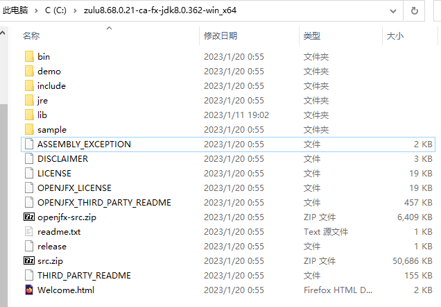
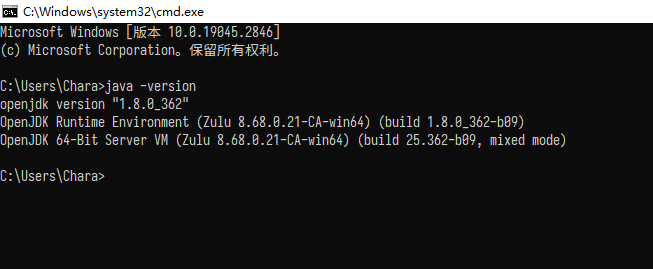
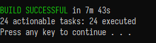
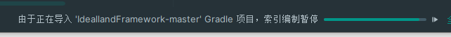
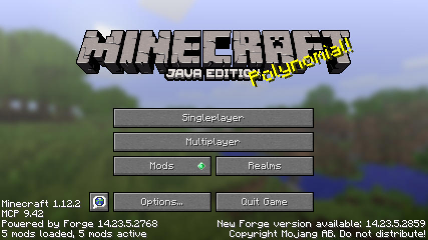

# 新版IDF(Idealland Framework) 使用详解

##### 教程更新时间 2023.4.16

若有任何问题请保证你在对应步骤完完整整看了每一个字。若有更多问题请前往群 922674498 寻求管理或好心成员帮助

### 1. 软件、资源下载与部署
   * 下载[最新版IDF压缩包](https://github.com/IdeallandEarthDept/IdeallandFramework/archive/refs/heads/master.zip)。

     若因网络问题访问不了下载地址，请前往群 922674498，在群文件 “IDF” 文件夹下载管理随缘手动更新版的IDF压缩包。

     

   * 下载[JetBrains Toolbox](https://download.jetbrains.com/toolbox/jetbrains-toolbox-1.27.3.14493.exe) 并在里面下载IDEA Community Edition（可以自动更新IDEA）或直接下载 [IDEA 2023.1 Community Edition](https://download.jetbrains.com/idea/ideaIC-2023.1.exe) 并安装。

     Community Edition 与 Ultimate 对于模组开发来说没有区别，而Ultimate是付费的，Community Edition不是。

     

   * 下载[Zulu JDK 8 64位版本](https://cdn.azul.com/zulu/bin/zulu8.68.0.21-ca-jdk8.0.362-win_x64.zip)。除非你对自己的选择足够有信心，那么你可以选择不用我这里给出的JDK。不过我希望不要有人到时候来群里问问题然后发现是自己的Java版本问题。

     ​	

     **下载好之后请将其解压到一个盘符根目录,如 *C:\zulu8.68.0.21-ca-jdk8.0.362-win_x64*，并记住你放置的这个地址**。现在直接进入这个地址，你应当能在其目录下**直接**看到 *bin lib* 等文件夹。若里面还有一层 *zulu8.68.0.21-ca-jdk8.0.362-win_x64*，请手动将其里面的所有内容复制到上一层的 *zulu8.68.0.21-ca-jdk8.0.362-win_x64*。

     现在你的**盘符:\zulu8.68.0.21-ca-jdk8.0.362-win_x64** 里面应该是这样的：
     
     
     
     现在，打开你的系统设置，依次点击 系统 ->（左侧）关于 -> （右侧）高级系统设置，你会发现有一个新的窗口被弹了出来。点击它上面的“环境变量”，首先双击上方用户变量中的Path一栏，将里面有可能存在的任何带有Java这四个字的条目选中并删除，删除后点击确认，保存，并在下方系统变量中找到Path，重复这一操作。
     
     现在，点击下方 新建 按钮，在上方输入 **JAVA_HOME** （推荐直接复制） ，下方填入之前你记住的那个地址，形式应类似为 **C:\zulu8.68.0.21-ca-fx-jdk8.0.362-win_x64** （**盘符:\zulu8.68.0.21-ca-fx-jdk8.0.362-win_x64**）。若已存在JAVA_HOME可以直接修改原有的项。
     
     打开 系统变量 中的 Path，点击新建，输入 **%JAVA_HOME%\\bin\\**  （，不要带这个括号和这个逗号！！！只复制加黑的部分）点击确认。
     
     打开你的cmd，输入java -version。你现在应该看到的会是这个样子：
     
     
     
     
     
     如果你做到了这一步还没有出错，那么恭喜你，胜利就在眼前
     
     
     
   * 还记得一开始让你下载的那个idf吗？没错，现在要用到它了，将它解压到一个不带有中文路径的文件夹，用户名称是中文也不行哦。

     如果你的用户名称是中文的话，在后面会遇到一些问题，请来群里或自行解决一下。

     打开你解压好的idf，你现在应当能直接双击运行 **1_其一_setupDecomp_请先运行此脚本_再打开IDE.bat**，并根据个人电脑以及网络的差异，等待5-20分钟，运行完后弹出提示 （绿色）BUILD SUCCESSFUL Press any key to continue...如图：

     

### 2. 开始使用IDF

* 打开你的IDEA，点击 Plugins，根据个人喜好选择是否安装 Chinese (Simplified) Language Pack / 中文语言包 以启用汉化，本篇教程将启用汉化。安装汉化后应提示你重启idea，直接点击立即重启就好。

* 点击 右上角的 打开按钮，选择你刚刚部署好的IDF目录。你选择的目录应当是这个样子的：

  

  它左边的图标应当与其他的文件夹区分开来，是不一样的图标。选中这个文件夹后请直接点击 确认 按钮，并选择 “信任项目”。

* 打开项目后你应当在你的IDEA的下方看到这样一个进度条：

  

  请等待这个地方的所有正在出现和即将进度条完全消失。本过程会耗时5-15分钟，与电脑性能相关。一切完毕后你应当能直接在IDEA上方看到：

  

  单击绿色小三角，你的Minecraft客户端应该已经启动了，并且有Idealland Framework的信息。恭喜，你已经完成了IDF的部署任务，接下来开始使用它吧。

  
